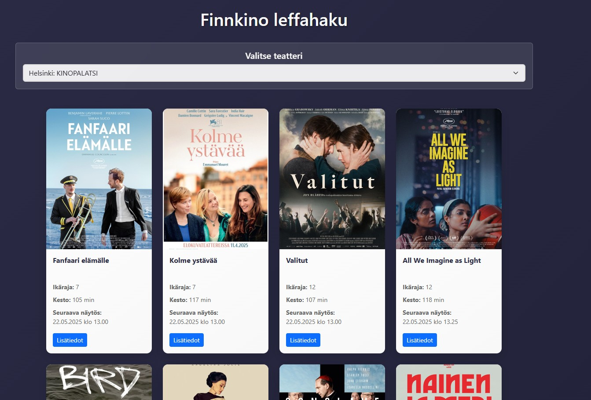
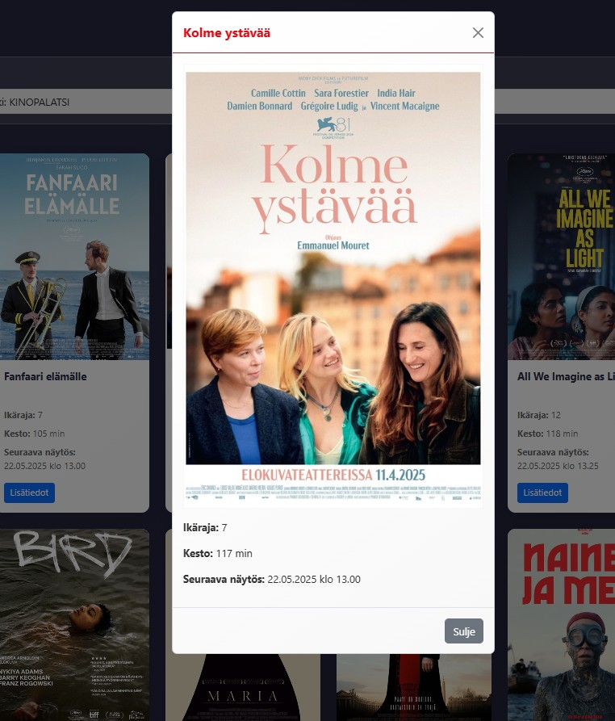

# Finnkino leffahaku-sovellus
Marianna Raitamaa ja Emilia Ahti

## Demo linkki:

Github: https://github.com/EmiliaAhti/jQuery-sovellus

Netlify: https://jqueryleffahaku.netlify.app/

## Miten työ on toteutettu

Projekti on toteutettu suurimmaksi osaksi yhteistyöllä sovittuina tapaamisaikoina teamsin välityksellä
  

ja tapaamisten välillä olemme sopineet pienempiä osia, joita molemmat ovat edistäneet itsenäisesti.

## Table of Content:

- [Sovelluksen esittely](#about-the-app)
- [Kuva sovelluksesta](#screenshots)
- [Käytetyt teknologiat](#technologies)
- [Lähteet](#credits)

## Sovelluksen esittely

Finnkino leffahaku sovelluksesta löydät tiedot elokuvateattereissa pyörivistä elokuvista. 

Ensin valitaan teatteri sivun yläreunassa olevasta “Finnkino leffahaku” pudotusvalikosta. 

Teatterin valinnan jälkeen sovellus listaa esille kaikki kyseisen teatterin seuraavat näytökset. 

Listauksessa on näkyvillä elokuvan kansikuva, ikäraja, elokuvan kesto, sekä seuraavan näytöksen päivämäärä ja kellonaika. 

Lisätiedot nappia painamalla avautuu yksittäisen elokuvan lisätiedot erilliseen pop-up ikkunaan

## Kuva sovelluksesta

## Käytetyt teknologiat
<ul>
  <li>HTML</li>
  <li>CSS</li>
  <li>Javascript</li>
  <li>Finnkino XML API</li>
  <li>AJAX kutsut jQuery funktiolla</li>
  <li>jQuery tehosteet</li>
  <li>Komponenttikirjasto Bootstrap</li>
</ul>
- Teatterilistaus : https://www.finnkino.fi/xml/TheatreAreas/
- Näytösaikataulu : https://www.finnkino.fi/xml/Schedule/

## Lähteet

Lähteinä käytetty tuntimateriaalia, w3Schoolin materiaaleja, videotutoriaaleja ja koodin tarkistukseen chatgpt.

